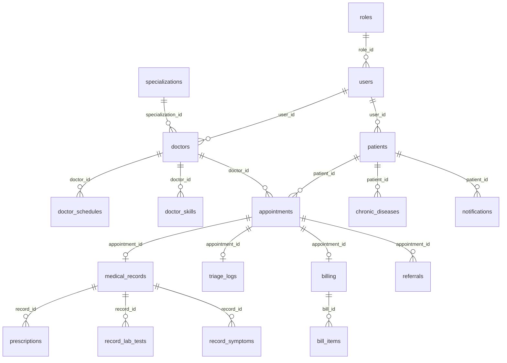

<p align="center">
  
  
  
  
</p>

<h1 align="center">🏥 Shifa+ (شفاء+)</h1>
<h3 align="center">AI-Powered Smart Medical Appointment Triage & Clinic Management System</h3>

<p align="center">
  <em>The first Arabic-native medical booking system that prioritizes appointments by clinical urgency instead of first-come-first-served.</em>
</p>

---

## 📋 Table of Contents

- [Overview](#overview)
- [Key Features](#key-features)
- [System Architecture](#system-architecture)
- [Technology Stack](#technology-stack)
- [Database Schema](#database-schema)
- [AI Triage Engine](#ai-triage-engine)
- [API Reference](#api-reference)
- [Role-Based Access Control](#role-based-access-control)
- [Installation & Setup](#installation--setup)
- [Project Structure](#project-structure)
- [Screenshots & UI](#screenshots--ui)
- [Security Considerations](#security-considerations)
- [References & Inspirations](#references--inspirations)
- [Contributing](#contributing)
- [License](#license)

---

## Overview

**Shifa+** (شفاء+) is a full-stack, AI-powered medical clinic management system designed for Arabic-speaking healthcare environments. Unlike traditional appointment booking systems that follow a strict chronological order, Shifa+ introduces an **intelligent triage layer** that classifies patients by clinical urgency—ensuring critical cases are never delayed behind routine visits.

The system integrates with large language models (LLMs) from **Groq**, **Google Gemini**, and **OpenAI** for real-time symptom analysis, specialty routing, and cascade scheduling.

### Core Value Proposition

| Traditional System | Shifa+ |
|---|---|
| First-come, first-served | Priority-based scheduling |
| Manual specialty selection | AI-driven specialty routing |
| Static slot booking | Cascade rescheduling for emergencies |
| No symptom analysis | NLP-powered symptom classification |

---

## Key Features

### 🤖 AI-Powered Triage Engine
- **Symptom Classification**: Analyzes patient symptoms using NLP and classifies them into three priority levels: **Critical**, **Medium**, and **Routine**.
- **Specialty Routing**: Automatically maps symptoms to the correct medical specialty (e.g., "chest pain radiating to arm" → Cardiology/Emergency).
- **Chronic Disease Awareness**: Adjusts urgency scores based on pre-existing conditions (e.g., diabetic patient with nausea gets elevated priority).
- **Confidence Scoring**: Provides a numerical confidence score for each triage decision.

### 🔄 Cascade Scheduling System
- **Queue Jumping**: When a critical patient arrives and all doctors are booked, the system automatically reschedules lower-priority patients.
- **Cascade Shift Algorithm**: Implements a multi-step rescheduling strategy that minimizes disruption to existing appointments.
- **Rule-Based Fallback**: If AI APIs are unavailable, the system falls back to a local keyword-based priority engine with 50+ pre-mapped medical keywords.

### 👨‍⚕️ Multi-Role Dashboards
- **Admin Portal**: System-wide statistics, doctor/patient management, performance analytics, and system settings.
- **Doctor Portal**: Real-time patient queue with priority filtering, emergency alerts, schedule management, referral system, and appointment details with AI summaries.
- **Patient Portal**: Booking wizard (Smart AI or Regular), medical records, prescriptions, billing, health summary, and notifications.

### 🗓️ Dual Booking Modes
- **Smart Booking**: AI-driven flow where symptoms are analyzed and the system auto-selects the best doctor, date, and time.
- **Regular Booking**: Traditional manual flow where patients choose their specialty, doctor, and time slot.

### 📋 Medical Records & Prescriptions
- Complete medical history tracking per patient.
- Doctor notes, diagnoses, follow-up scheduling.
- Prescription management with medication details, dosage, frequency, and duration.
- Lab test tracking and symptom recording.

### 🔔 Real-Time Notifications
- Emergency red alerts on doctor dashboards for critical patients.
- Notification badge system with unread count.
- Flash messages via URL parameters for cross-page communication.

### 🔀 Doctor Referral System
- Doctors can refer patients to specialists with clinical summaries.
- Priority-based referral routing (Routine, Urgent, Emergency).
- Full referral lifecycle tracking (Pending → Accepted → Completed).

---

## System Architecture

```
┌──────────────────────────────────────────────────────────────┐
│                     CLIENT LAYER (Browser)                     │
│  ┌─────────┐  ┌──────────┐  ┌─────────┐  ┌──────────────┐    │
│  │ Landing  │  │   Auth   │  │ Patient │  │  Doctor/Admin │    │
│  │  Page    │  │  Pages   │  │  Portal │  │   Portals     │    │
│  └────┬─────┘  └────┬─────┘  └────┬─────┘  └──────┬───────┘    │
│       │              │             │               │            │
│       └──────────────┼─────────────┼───────────────┘            │
│                      │ fetch() / JSON API                      │
└──────────────────────┼─────────────────────────────────────────┘
                       │
            ┌──────────▼──────────┐
            │   .htaccess Router  │  (Apache mod_rewrite)
            │   /api/* → PHP     │
            └──────────┬──────────┘
                       │
┌──────────────────────┼─────────────────────────────────────────┐
│                  SERVER LAYER (PHP 8.2)                         │
│  ┌────────────────┐  ┌────────────────┐  ┌──────────────────┐  │
│  │ AuthController │  │BookingController│  │ DoctorController │  │
│  │ • login        │  │ • specializations│ │ • dashboard      │  │
│  │ • register     │  │ • doctors       │  │ • today_queue    │  │
│  │ • forgot_pass  │  │ • slots         │  │ • save_treatment │  │
│  │ • verify_code  │  │ • triage (AI)   │  │ • referrals      │  │
│  │ • reset_pass   │  │ • book          │  │ • get_schedule   │  │
│  └────────────────┘  └───────┬────────┘  └──────────────────┘  │
│  ┌────────────────┐          │           ┌──────────────────┐   │
│  │PatientController│         │           │ AdminController  │   │
│  │ • dashboard    │  ┌───────▼────────┐  │ • dashboard      │   │
│  │ • profile      │  │  TriageAI      │  │ • manage_doctors │   │
│  │ • records      │  │  Service       │  │ • manage_patients│   │
│  │ • prescriptions│  │ ┌────────────┐ │  │ • reports        │   │
│  │ • cancel_appt  │  │ │ AI Engine  │ │  │ • settings       │   │
│  └────────────────┘  │ │ (Groq/    │ │  └──────────────────┘   │
│  ┌────────────────┐  │ │ Gemini/   │ │                         │
│  │ Notification   │  │ │ OpenAI)   │ │                         │
│  │ Controller     │  │ ├────────────┤ │                         │
│  │ • list         │  │ │ Rule-Based│ │                         │
│  │ • mark_read    │  │ │ Fallback  │ │                         │
│  └────────────────┘  │ └────────────┘ │                         │
│                      └───────┬────────┘                         │
│                              │                                  │
│              ┌───────────────▼───────────────┐                  │
│              │   includes/                    │                  │
│              │   • session.php (RBAC)         │                  │
│              │   • functions.php (Utilities)  │                  │
│              └───────────────┬───────────────┘                  │
└──────────────────────────────┼──────────────────────────────────┘
                               │
                    ┌──────────▼──────────┐
                    │  MariaDB 10.4       │
                    │  Database:           │
                    │  hagz_clinic_ai      │
                    │  (15 tables,         │
                    │   UTF-8 mb4)         │
                    └─────────────────────┘
```

---

## Technology Stack

| Layer | Technology |
|---|---|
| **Backend** | PHP 8.2 (vanilla, no framework) |
| **Database** | MariaDB 10.4 / MySQL — PDO with UTF-8 mb4 |
| **Web Server** | Apache with mod_rewrite |
| **AI Providers** | Groq (default), Google Gemini, OpenAI |
| **AI Model** | `llama-3.3-70b-versatile` (Groq) |
| **Frontend** | HTML5, CSS3, Vanilla JavaScript |
| **CSS Framework** | Bootstrap 5.3 RTL (patient/landing pages) |
| **Icons** | Boxicons 2.1.4, Font Awesome 6.5 |
| **Fonts** | Cairo, Tajawal (Google Fonts) |
| **Language** | Arabic (RTL) — primary interface language |
| **Auth** | PHP Sessions + `password_hash` (bcrypt) |

---

## Database Schema

The system uses **15 relational tables** in the `hagz_clinic_ai` database:



### Table Descriptions

| Table | Purpose |
|---|---|
| `users` | All system users (doctors, patients, admins) |
| `roles` | Role definitions (Admin=1, Doctor=2, Patient=3, Receptionist=4) |
| `patients` | Patient-specific data (DOB, gender, blood type, vitals) |
| `doctors` | Doctor profiles (specialization, license, fee, bio) |
| `specializations` | Medical specialties (8 departments with icons) |
| `doctor_schedules` | Weekly availability per doctor (shift, slot duration) |
| `doctor_skills` | Doctor competencies and certifications |
| `appointments` | Core appointment records with status lifecycle |
| `triage_logs` | AI triage decisions (priority, reasoning, confidence) |
| `medical_records` | Clinical records (diagnosis, notes, follow-up) |
| `prescriptions` | Medication prescriptions linked to records |
| `record_lab_tests` | Laboratory test orders and results |
| `record_symptoms` | Patient symptoms with pain level and duration |
| `chronic_diseases` | Patient chronic conditions for risk assessment |
| `notifications` | In-app notifications for patients and doctors |
| `billing` | Invoice records per appointment |
| `bill_items` | Individual line items per invoice |
| `referrals` | Doctor-to-doctor referral workflow |
| `system_settings` | Global system configuration (single row) |

### Medical Specializations (Seeded)

| ID | Arabic Name | English | Icon |
|---|---|---|---|
| 1 | طب عام | General Medicine | `bx-plus-medical` |
| 2 | طب طوارئ | Emergency Medicine | `bx-first-aid` |
| 3 | طب باطني | Internal Medicine | `bx-heart` |
| 4 | جراحة | Surgery | `bx-plus-circle` |
| 5 | أطفال | Pediatrics | `bx-child` |
| 6 | عظام | Orthopedics | `bx-body` |
| 7 | أعصاب | Neurology | `bx-brain` |
| 8 | نساء وولادة | OB/GYN | `bx-female-sign` |

---

## AI Triage Engine

The AI triage engine (`services/TriageAI.php`) is the core differentiating feature of Shifa+.

### How It Works

```
Patient Symptoms → AI Classification → Priority Assignment → Smart Scheduling
                                                                    ↓
                                                           Cascade Rescheduling
                                                           (if needed for Critical)
```

### Classification Pipeline

1. **Input Processing**: Patient symptoms, pain level (1-10), duration, and chronic diseases are collected from the booking wizard.
2. **AI Analysis**: A structured JSON prompt is sent to the LLM asking for:
   - `priority`: Critical | Medium | Routine
   - `specialty`: Recommended medical specialization
   - `reasoning`: Explanation of the classification decision
   - `confidence`: 0.0 – 1.0 confidence score
3. **Smart Scheduling**: The AI then receives available doctor slots and returns the optimal appointment placement, including any rescheduling instructions.
4. **Cascade Execution**: If rescheduling is needed, the system moves lower-priority patients to adjacent slots.

### Priority Levels

| Priority | Arabic | Trigger Criteria | Action |
|---|---|---|---|
| **Critical** | حرجة | Pain ≥ 9, high symptom score, cardiac/respiratory keywords | Emergency routing, queue jumping, immediate slot |
| **Medium** | عاجلة | Pain ≥ 6, moderate symptoms, recent onset | Priority scheduling within hours |
| **Routine** | مستقرة | Low pain, stable symptoms, chronic management | Standard scheduling |

### Fallback Engine

When AI APIs are unreachable, a local **rule-based engine** activates with:
- **50+ Arabic/English medical keywords** mapped to priority levels and specialties.
- **Weighted scoring** based on symptom severity, pain level, duration, and chronic conditions.
- **Keyword matching**: e.g., `نزيف` (bleeding), `إغماء` (fainting), `ضيق تنفس` (difficulty breathing) → Critical.

### AI Provider Configuration

```php
// config/ai.php
'provider'  => 'groq',                    // groq | gemini | openai
'api_key'   => getenv('GROQ_API_KEY'),    // Environment variable
'model'     => 'llama-3.3-70b-versatile', // Default model
'fallback_models' => [
    'llama-3.1-8b-instant',
    'gemma2-9b-it'
],
```

---

## API Reference

All API endpoints are accessed via PHP controllers with action-based routing.

### Authentication (`AuthController.php`)

| Method | Endpoint | Action | Description |
|---|---|---|---|
| POST | `/controllers/AuthController.php?action=login` | `login` | Email/password login, returns redirect URL |
| POST | `/controllers/AuthController.php?action=register` | `register` | Patient registration (multi-step) |
| POST | `/controllers/AuthController.php?action=forgot_password` | `forgot_password` | Send OTP to email/phone |
| POST | `/controllers/AuthController.php?action=verify_code` | `verify_code` | Verify 6-digit OTP |
| POST | `/controllers/AuthController.php?action=reset_password` | `reset_password` | Set new password |

### Booking (`BookingController.php`)

| Method | Endpoint | Action | Description |
|---|---|---|---|
| GET | `?action=specializations` | `specializations` | List active specializations |
| GET | `?action=doctors&spec=...` | `doctors` | Doctors by specialization |
| GET | `?action=slots&doctor_id=...&date=...` | `slots` | Available time slots |
| POST | `?action=triage` | `triage` | AI symptom analysis & scheduling |
| POST | `?action=book` | `book` | Create appointment |

### Patient (`PatientController.php`)

| Method | Endpoint | Action | Description |
|---|---|---|---|
| GET | `?action=dashboard` | `dashboard` | Stats + upcoming appointments |
| GET | `?action=profile` | `profile` | Patient profile + chronic diseases |
| POST | `?action=update_profile` | `update_profile` | Update profile data |
| GET | `?action=records` | `records` | Medical records history |
| GET | `?action=prescriptions` | `prescriptions` | Active prescriptions |
| GET | `?action=bills` | `bills` | Billing history |
| POST | `?action=cancel_appointment` | `cancel_appointment` | Cancel an appointment |

### Doctor (`DoctorController.php`)

| Method | Endpoint | Action | Description |
|---|---|---|---|
| GET | `?action=dashboard` | `dashboard` | Doctor stats + upcoming list |
| GET | `?action=today_queue` | `today_queue` | Today's patient queue with priority |
| GET | `?action=appointment_details&id=...` | `appointment_details` | Full appointment detail with AI triage |
| POST | `?action=save_treatment` | `save_treatment` | Save diagnosis, notes, prescriptions |
| POST | `?action=update_status` | `update_status` | Change appointment status |
| GET | `?action=get_schedule` | `get_schedule` | Doctor weekly schedule |
| POST | `?action=update_schedule` | `update_schedule` | Modify schedule availability |
| GET | `?action=profile` | `profile` | Doctor profile data |
| POST | `?action=create_referral` | `create_referral` | Create doctor-to-doctor referral |
| GET | `?action=my_referrals` | `my_referrals` | Referrals sent/received |
| GET | `?action=doctors` | `doctors` | List all active doctors |

### Admin (`AdminController.php`)

| Method | Endpoint | Action | Description |
|---|---|---|---|
| GET | `?action=dashboard` | `dashboard` | System-wide stats + performance |
| GET | `?action=doctors` | `doctors` | All doctors with specializations |
| POST | `?action=add_doctor` | `add_doctor` | Register a new doctor |
| POST | `?action=toggle_doctor` | `toggle_doctor` | Activate/deactivate doctor |
| GET | `?action=patients` | `patients` | Patient list with appointment counts |
| GET | `?action=reports` | `reports` | Appointment reports with filters |
| GET | `?action=settings` | `settings` | System settings |
| POST | `?action=update_settings` | `update_settings` | Update system configuration |

### Notifications (`NotificationController.php`)

| Method | Endpoint | Action | Description |
|---|---|---|---|
| GET | `?action=list` | `list` | Patient notifications |
| POST | `?action=mark_read` | `mark_read` | Mark notification as read |

---

## Role-Based Access Control

The system enforces strict RBAC via `includes/session.php`:

| Role ID | Role | Dashboard | Capabilities |
|---|---|---|---|
| 1 | **Admin** | `admin/admin.php` | Full system oversight, doctor/patient management, settings |
| 2 | **Doctor** | `doctor/Doctor_dashboard.php` | Patient queue, treatment, referrals, schedule, reports |
| 3 | **Patient** | `patient/dashboard-new.php` | Booking, records, prescriptions, profile, notifications |
| 4 | **Receptionist** | *(Not yet implemented)* | Reserved for future front-desk role |

### Session Guards

- `require_role(ROLE_ADMIN)` — Page-level PHP guard that redirects unauthorized users to login.
- `require_any_role([ROLE_DOCTOR, ROLE_ADMIN])` — Multi-role guard.
- `json_require_role(ROLE_PATIENT)` — API-level guard that returns JSON error.

---

## Installation & Setup

### Prerequisites

- **PHP** ≥ 8.2 with extensions: `pdo_mysql`, `curl`, `json`, `mbstring`
- **MariaDB** ≥ 10.4 / MySQL ≥ 8.0
- **Apache** with `mod_rewrite` enabled
- **AI API Key** (at least one of: Groq, Gemini, or OpenAI)

### Steps

1. **Clone the Repository**
   ```bash
   git clone https://github.com/your-repo/hagz.git
   cd hagz
   ```

2. **Configure the Database**
   - Create a MySQL/MariaDB database:
     ```sql
     CREATE DATABASE hagz_clinic_ai CHARACTER SET utf8mb4 COLLATE utf8mb4_unicode_ci;
     ```
   - Import the schema:
     ```bash
     mysql -u root -p hagz_clinic_ai < "hagz_clinic_ai (1).sql"
     ```

3. **Configure Database Connection**
   - Edit `config/database.php`:
     ```php
     $host = '127.0.0.1';
     $db   = 'hagz_clinic_ai';
     $user = 'root';
     $pass = '';
     ```

4. **Configure AI Provider**
   - Set your API key as an environment variable:
     ```bash
     export GROQ_API_KEY="gsk_your_api_key_here"
     ```
   - Or edit `config/ai.php` directly (not recommended for production).

5. **Configure Apache Virtual Host**
   - Point the DocumentRoot to the project directory.
   - Ensure `.htaccess` is enabled (`AllowOverride All`).
   - The project expects to be served under the `/Hagz/` path (configurable in `.htaccess`).

6. **Launch**
   - Access the system at `http://localhost/Hagz/public/index.php`

### Default Credentials (from SQL seed)

| Role | Email | Password |
|---|---|---|
| Admin | `admin@hagz.com` | *(check SQL seed — bcrypt hash)* |
| Doctor | `abdulaziz@hagz.sa` | *(same seeded hash)* |

> ⚠️ **Note**: All seeded users share the same bcrypt password hash. The plaintext password should be obtained from the development team.

---

## Project Structure

```
hagz/
├── .htaccess                        # Apache URL rewriting rules
├── logout.php                       # Session destruction & redirect
├── hagz_clinic_ai (1).sql           # Full database schema + seed data
│
├── config/
│   ├── database.php                 # PDO database connection (UTF-8 mb4)
│   └── ai.php                       # AI provider configuration
│
├── includes/
│   ├── session.php                  # Session management & RBAC guards
│   └── functions.php                # Utility helpers (sanitize, validate, etc.)
│
├── services/
│   └── TriageAI.php                 # AI triage engine (classify + schedule)
│
├── controllers/
│   ├── AuthController.php           # Login, register, password reset
│   ├── BookingController.php        # Booking wizard API (triage + slots + book)
│   ├── PatientController.php        # Patient dashboard, profile, records
│   ├── DoctorController.php         # Doctor queue, treatment, schedule, referrals
│   ├── AdminController.php          # Admin dashboard, management, reports
│   └── NotificationController.php   # Patient notification system
│
├── public/
│   ├── index.php                    # Landing page (marketing homepage)
│   ├── triage_reference.html        # Academic triage methodology reference
│   └── 404.html                     # Custom error page
│
├── auth/
│   ├── login.php                    # Login page
│   ├── signup.php                   # Multi-step registration
│   └── Reset_password.php           # 3-step password reset with OTP
│
├── admin/
│   ├── admin.php                    # Admin dashboard
│   ├── Add_doctor.php               # Doctor registration form
│   ├── Manage_doctors.php           # Doctor management table
│   ├── Manage_patients.php          # Patient management table
│   ├── Reports.php                  # Analytics & reporting
│   ├── System_settings.php          # System configuration
│   └── User_permissions.php         # User role management
│
├── doctor/
│   ├── Doctor_dashboard.php         # Doctor main dashboard
│   ├── My_appointments.php          # Appointment list
│   ├── Appointment_details.php      # Single appointment detail + AI triage
│   ├── Edit_appointment.php         # Appointment editor
│   ├── My_patients.php              # Patient list
│   ├── Doctor_reports.php           # Doctor-specific reports
│   ├── Doctor_referrals.php         # Referral management
│   └── Doctor_profile.php           # Profile & schedule settings
│
├── patient/
│   ├── dashboard-new.php            # Patient dashboard
│   ├── booking-new.php              # Smart/Regular booking wizard
│   ├── records-new.php              # Medical records
│   ├── prescriptions-new.php        # Prescriptions & billing
│   ├── notifications-new.php        # Notification center
│   ├── profile-new.php              # Profile management
│   └── partials/
│       └── patient-nav.php          # Shared sidebar & navbar component
│
├── assets/
│   ├── css/
│   │   ├── index.css                # Landing page styles
│   │   ├── auth.css                 # Authentication page styles
│   │   ├── shared-dashboard.css     # Shared dashboard layout
│   │   ├── admin-dashboard.css      # Admin-specific styles
│   │   ├── doctor-dashboard.css     # Doctor portal styles (largest CSS)
│   │   ├── patient.css              # Patient portal styles
│   │   └── ... (13 more CSS files)
│   ├── js/
│   │   ├── hagz-ui.js               # Shared UI system (toasts, confirm modals)
│   │   ├── patient-booking.js       # Booking wizard logic (558 lines)
│   │   └── notif-badge.js           # Doctor notification badge updater
│   └── img/
│       └── avatars/                 # User avatar storage
│
└── uploads/
    └── doctors/                     # Doctor profile images
```

---

## Security Considerations

| Area | Implementation |
|---|---|
| **Authentication** | `password_hash()` with bcrypt (PHP default) |
| **SQL Injection** | PDO prepared statements throughout all controllers |
| **XSS Protection** | `htmlspecialchars()` on all user-facing output |
| **CSRF** | Not explicitly implemented — relies on session validation |
| **Input Validation** | Server-side validation in `functions.php` (email, phone, sanitization) |
| **Session Security** | Session timeout, IP/UA binding check in `session.php` |
| **API Keys** | Stored in environment variables (`getenv()`) |
| **File Uploads** | Limited to doctor profile images with server-side path validation |
| **Role Enforcement** | Page-level and API-level RBAC guards on every protected endpoint |

### Known Limitations

- No CSRF token implementation — Session-based auth only.
- OTP for password reset is stored in `$_SESSION`, not emailed (development mode).
- No rate limiting on login attempts.
- No HTTPS enforcement at application level (depends on server config).

---

## References & Inspirations

The triage methodology in Shifa+ is inspired by established medical triage systems:

1. **Emergency Severity Index (ESI)** — AHRQ (U.S. Agency for Healthcare Research and Quality)
2. **NHS 111** — UK National Health Service digital triage using decision trees
3. **Ada Health** — AI-powered symptom assessment platform
4. **Symptomate** — Primary care symptom-to-specialty matching engine

---

## System Settings

The `system_settings` table provides configurable parameters:

| Setting | Default | Description |
|---|---|---|
| `hospital_name` | مستشفى شفاء+ | System display name |
| `default_language` | `ar` | Interface language |
| `timezone` | `Asia/Riyadh` | Server timezone |
| `ai_triage_enabled` | `1` | Enable/disable AI triage |
| `critical_pain_threshold` | `8` | Pain level that triggers critical priority |
| `urgent_duration_limit` | `24 hours` | Duration threshold for urgent classification |
| `default_consultation_minutes` | `30` | Default appointment slot duration |
| `allow_telehealth` | `1` | Enable telehealth appointments |
| `maintenance_mode` | `0` | System maintenance flag |

---

## Contributing

This project is an academic/capstone initiative. Contributions should:
1. Follow the existing code style (PHP PSR-adjacent, Arabic comments).
2. Maintain RTL (Right-to-Left) layout compatibility.
3. Test AI fallback paths when modifying the triage engine.
4. Preserve the Arabic-first UI language approach.

---

## License

This project is developed for academic purposes. Contact the repository owner for licensing inquiries.

---

<p align="center">
  <strong>شفاء+</strong> — لأن صحتك لا تنتظر 🏥
</p>
